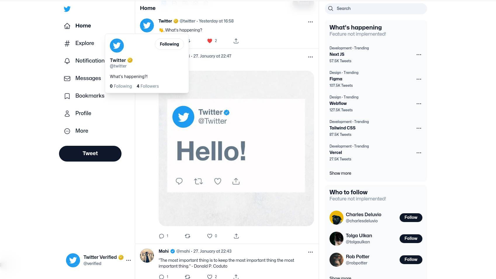

# Twitter Clone

Full-Stack Twitter clone web app built with Next.Js / React.Js / Tailwind & Radix UI.

- Backend - Node.Js / MongoDB



## Features

- ✅ Text/Image tweet - [!only-1-image]
- ✅ like, reply to tweet
- ✅ search/follow/unfollow user
- ✅ user profile, update profile
- ✅ follow, tweet like/reply notification
- ✅ twitter blue
- ✅ cover upload, profile/cover/tweet-image zoom view

## TODO

- [ ] tweet notification
- [ ] tweet retweet, quote retweet
- [ ] tweet tags
- [ ] tweet : multiple image upload

## Getting Started

- Clone this repo:

```bash
  git clone https://github.com/itsbohara/twitter-clone
```

- Config `.env` using reference `.env.example` file

To install the packages:

```bash
bun install
# or
bun run dev
```

### Project Structure

- _`client`_ - axios api client
- _`components`_ - shared components used across - the app
- _`contexts`_ - context providers
- _`guards`_ - route guards
- _`hooks`_ - shared hooks
- _`redux`_ - global app store
- _`sections`_ - part of pages, composition of components
- _`pages`_ - main app pages
- _`utils`_ - shared utility functions

### Backend Server 🗄️

I have used Node/Mongo/Express for backend server implementation.
- Repo Link - https://github.com/mblearningprojects/twitter-clone-server

### Special Thanks

I would like to give special thanks to [royquilor](https://github.com/royquilor) for awesome [twitter-ui-clone](https://github.com/royquilor/twitter-ui-practise) implementation.

### Deploy on Vercel

The easiest way to deploy your Next.js app is to use the [Vercel Platform](https://vercel.com/new?utm_medium=default-template&filter=next.js&utm_source=create-next-app&utm_campaign=create-next-app-readme) from the creators of Next.js.

Check out our [Next.js deployment documentation](https://nextjs.org/docs/deployment) for more details.
